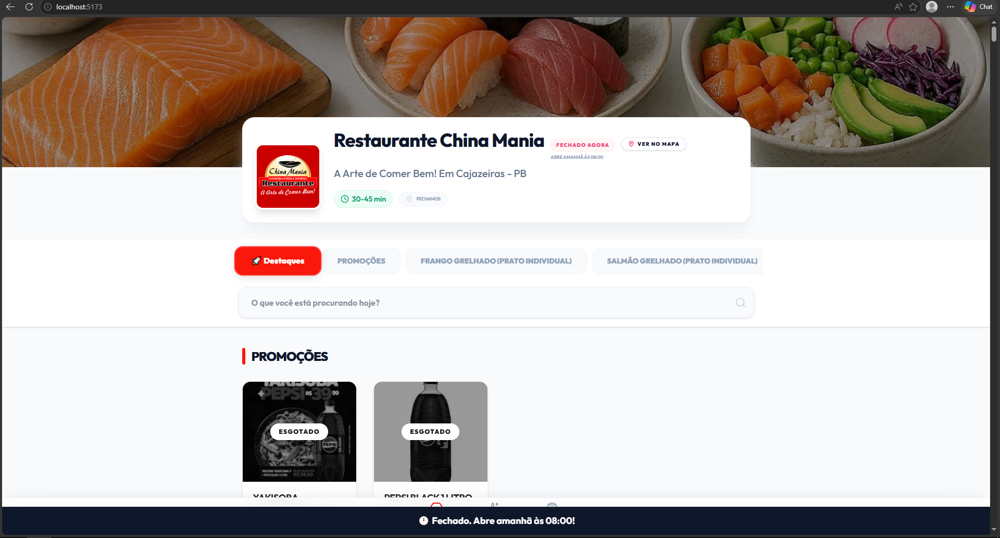
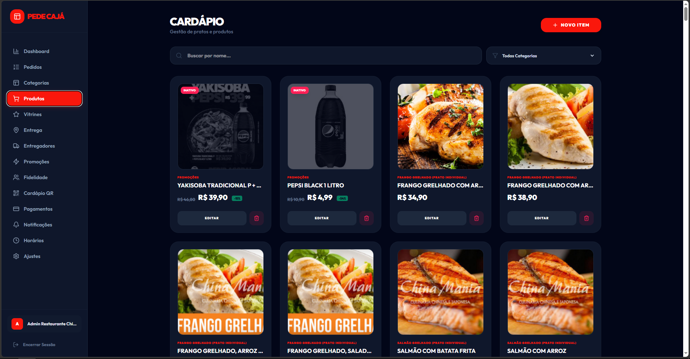

# PedeCaja – Demo

Exemplo do sistema PedeCaja, demonstrando funcionalidades e fluxo de operação de uma aplicação de gestão de pedidos e entregas.

---

## Visão geral

O PedeCaja é um sistema desenvolvido para centralizar o gerenciamento de pedidos, produtos e acompanhamento operacional em uma única interface.

A aplicação foi projetada para facilitar o controle de operações e organizar o fluxo de trabalho de forma clara e eficiente.

---

## Funcionalidades demonstradas

- Gestão de pedidos
- Atualização de status
- Controle de entregas
- Painel administrativo
- Interface responsiva
- GPS
- Pagamento via PIX e Cartão

---

## Interface do sistema

### Dashboard do cliente

---

### Gestão de produtos

---

## Observação

Este repositório é de caráter demonstrativo e representa uma versão funcional do sistema PedeCaja.
